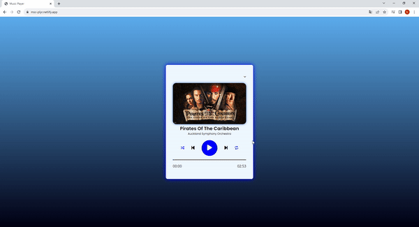

<h1>MP3-Player Project</h1>

If you love music and your interest in technology has led you on a creative journey, I have some exciting news for you! I have created my own personal music player application using the latest technologies such as HTML5, CSS3, and JavaScript, and I'm thrilled to share this application with you. Now, I want to present this application to you, which I designed with my own hands, to truly control, customize, and listen to music.

<h2> Technologies I Use </h2>

⭐ HTML5: With this technology, I can seamlessly manage audio streaming and playlists.
⭐ CSS3: I use CSS3 to enhance my visual design and customize themes.
⭐ JavaScript: By using JavaScript to control music and transitions, I've made the application more interactive.

<h2>Screenshot</h2>

